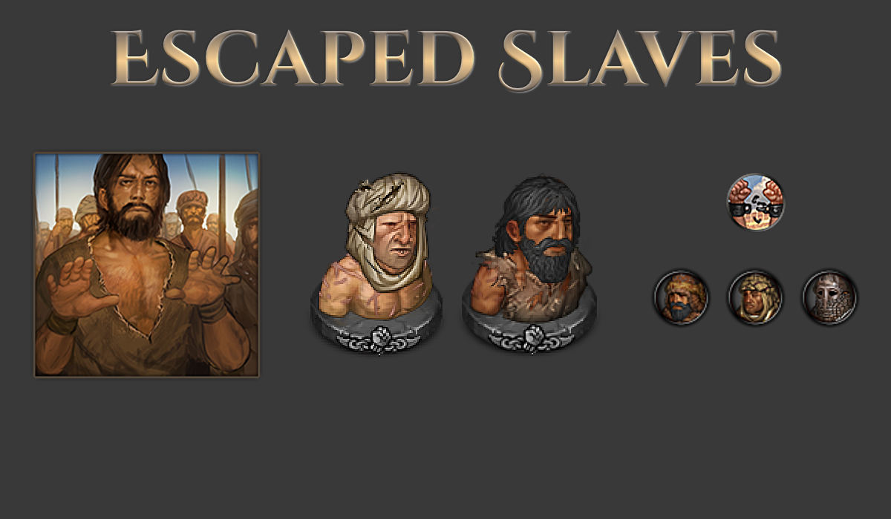

# Sato's Escaped Slaves Origin

A mod for the game Battle Brothers ([Steam](https://store.steampowered.com/app/365360/Battle_Brothers/), [GOG](https://www.gog.com/game/battle_brothers), [Developer Site](http://battlebrothersgame.com/buy-battle-brothers/)).

## Table of contents

-   [Features](#features)
-   [Requirements](#requirements)
-   [Installation](#installation)
-   [Uninstallation](#uninstallation)
-   [Compatibility](#compatibility)
-   [Credits](#credits)

## Features

Adds a new starting scenario, the Escaped Slaves, focused on protecting a core group of weak brothers from the City State that once imprisoned you. The quick summary:

- Start with five Indebted brothers and an assortment of stolen equipment.
- Indebted brothers gain a buff that makes them stronger for each other Indebted you field.
- The City State from which you escaped is always hostile and will periodically send manhunters* after you.
- Good relations with factions decay 15% faster, and bad relations recover 15% slower.

*The manhunters sent after you are a new mini-faction specific to this origin. They have a few unique unit types, and will ambush you without notice, so don't let your guard down!

## Requirements

1) [Modding Script Hooks](https://www.nexusmods.com/battlebrothers/mods/42) (v20 or later)
2) [Blazing Deserts](http://battlebrothersgame.com/blazing-deserts-release/)

## Installation

1) Download the mod from the [releases page](https://github.com/jcsato/sato_escaped_slaves_mod/releases/latest)
2) Without extracting, put the relevant `sato_escaped_slaves_origin_*.zip` file in your game's data directory
    1) For Steam installations, this is typically: `C:\Program Files (x86)\Steam\steamapps\common\Battle Brothers\data`
    2) For GOG installations, this is typically: `C:\Program Files (x86)\GOG Galaxy\Games\Battle Brothers\data`

## Uninstallation

1) Remove the `sato_escaped_slaves_origin_*.zip` file from your game's data directory

## Compatibility

Should be compatible with most everything. Saves made on other origin should continue to work if the mod is removed.

Don't use with Legends, that has its own version that is separately maintained.
